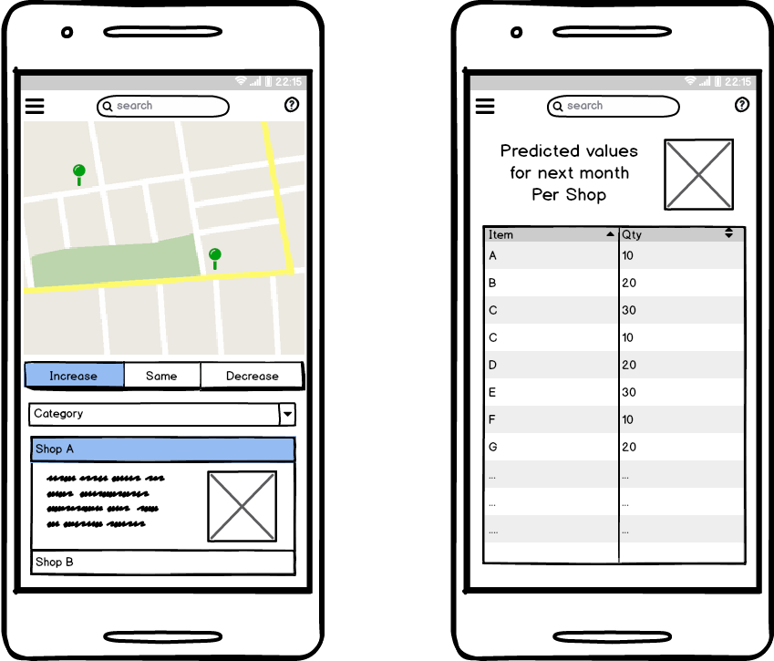

## RecOmax
Recommendation Platform

### Problem statement

 * Creating a product recommendation system
 * With the help of Machine Learning increase sales
 * Reduce time spent by Sales Representatives

### Solution

 * Create a Product to Store based recommendation system that is Centrally controlled
 * Recommendations made based on previous sales history of the product
 * Integrate Online sales trends to provide better real time product recommendation

### Recommendation engine

 * Product recommendations are made separately for each and every store depending on the sales history
 * Features include quantity of products sold, time of the year (monthly or weekly)
 * Location based features such as temperature and climate

 * Products sold together are recommended to the store by the distributor
 * Integration with e-commerce websites to provide a real time trend analysis
 * This will help analyse market position for each product separately

 * Online reviews work as a bonus factor to promote products
 * Incase of poor online performance of a product, it provides a range of factors to grade the competition
 * Integrating this complete platform will provide an edge over current traditional methods

### Expected output

 * Recommendation system with store based product recommendation
 * Distributors get sales information on each and every product sold to the store
 * Overall sales as a Key Performance Indicator (KPI)

### Wireframes

